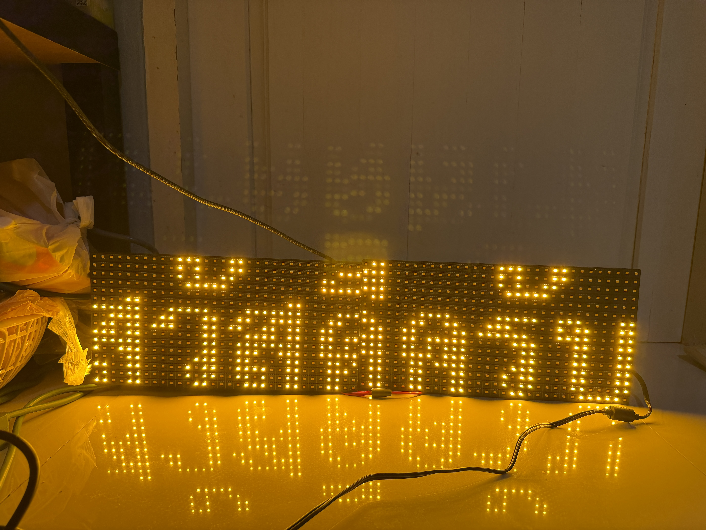
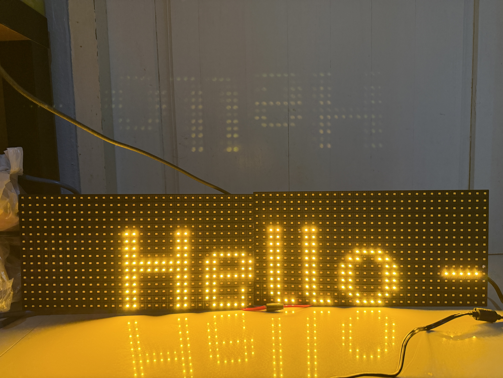

# SmartFont Library

A generic C++ font library for embedded systems (Arduino, ESP32, etc.), designed for efficient rendering of **UTF-8** strings on pixel-based displays.
It features special support for **Thai Language**, correctly positioning vowels and tone marks (0x0E00 - 0x0E7F).

## Overview


</br>



## Features

- **UTF-8 Support**: Handles multi-byte characters automatically.
- **Thai Language Layout**: Automatically adjusts vertical position of upper/lower vowels and tone marks to prevent overlapping.
- **Memory Efficient**: Fonts are stored in program memory (PROGMEM on AVR/ESP).
- **Callback Based**: Agnostic to display hardware. You provide `drawPixel` and `clearPixel` callbacks.
- **Font Converter**: Includes a Python tool to generate compatible C source files from `.ttf` or `.otf` fonts.

## Installation

1. Download this folder as a ZIP file.
2. In Arduino IDE, go to **Sketch** -> **Include Library** -> **Add .ZIP Library...**
3. Select the ZIP file.

## Usage

### 1. Include the Library and Font

```cpp
#include <SmartFont.h>
#include "fonts/font_th_sarabun_new_regular16.h" // Your generated font file
```

### 2. Define Callbacks

Defins functions that the library will call to draw pixels on your specific display hardware.

```cpp
void myDrawPixel(int16_t x, int16_t y) {
  display.drawPixel(x, y, 1); // Example for Adafruit_GFX
}

void myClearPixel(int16_t x, int16_t y) {
  display.drawPixel(x, y, 0);
}
```

### 3. Initialize and Print

```cpp
// Create instance
SmartFont smartFont(myDrawPixel, myClearPixel);

void setup() {
  smartFont.setFont(&font_th_sarabun_new_regular16);
  smartFont.setPos(0, 20);
  smartFont.print("Hello");
  smartFont.print("สวัสดีครับ");
}
```

## Creating Custom Fonts

See [tools/smart_font_ttf2c/README.md](tools/smart_font_ttf2c/README.md) for instructions on how to convert your own `.ttf` fonts to `.c` files compatible with this library.

## License

MIT License
